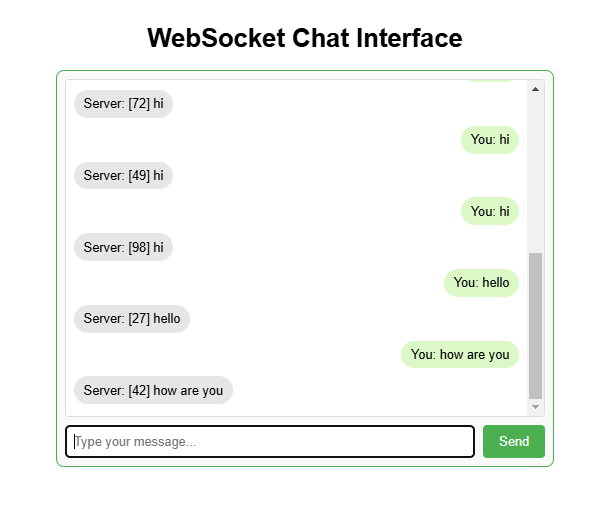
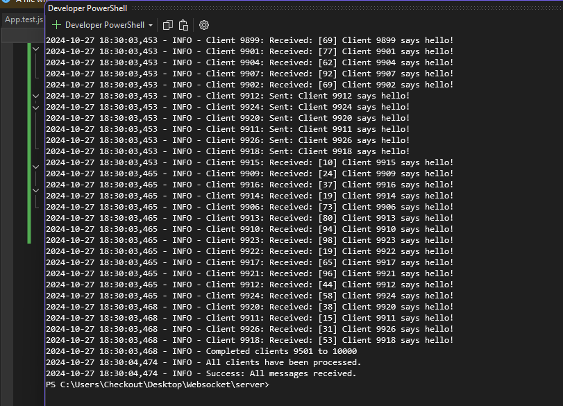

# WebSocket Client-Server Simulation

This project demonstrates a WebSocket-based client-server architecture that allows real-time message exchange between clients and a server. The server modifies each incoming message by appending a random number before sending it back to the client. A React-based UI is also provided to simulate a chat interface with the WebSocket server, making it easy to visualize and test WebSocket interactions.

---


## Overview

The main components of this project include:

1. **WebSocket Server**: A Python server that processes WebSocket connections, appends a random number to each message received from clients, and returns it back.

2. **Client Simulation Script**: A Python script that simulates 10,000 WebSocket clients sending messages to the server.

3. **React Client UI**: A web-based interface that allows users to send and receive messages to/from the WebSocket server, providing a real-time chat experience.

---

## Features

- **Real-Time Communication**: Uses the WebSocket protocol to maintain a full-duplex communication channel between clients and the server.

- **Server-Side Message Processing**: The server appends a random number to each incoming message and returns the modified message.

- **Load Testing**: The client simulation script can test server scalability by simulating a high number of concurrent connections.

- **Interactive UI**: A React-based web UI for sending messages to the server and viewing responses, ideal for testing WebSocket behavior.

---

## System Requirements

- **Python**: Version 3.7 or above
- **Node.js**: Version 14 or above (for the React client)
- **npm**: For managing Node.js packages

### Required Python Packages

- **websockets**: Install via `pip install websockets`

---

## Setup Instructions

### 1. Clone the Repository

Clone the repository to your local machine:

```bash
git clone <repository_url>
cd <repository_directory>
pip install websockets
```
### Set Up React Client

```
cd client
npm install
```

### Running the application

```
python server.py
python client.py
```

### Launch the React Interface

```
npm start
```

## Screenshots

### Output 1



### Output 2




